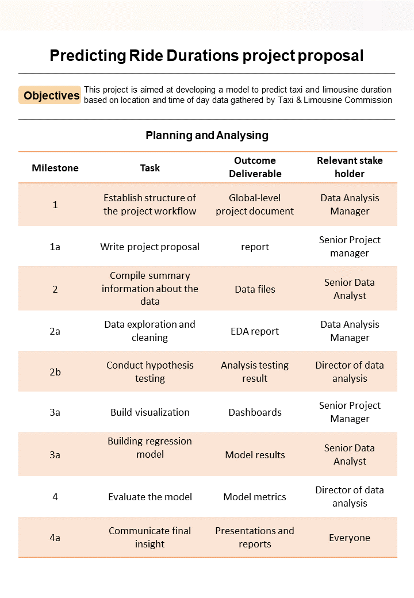

# 1

## Project Goal

New York City Taxi and Limousine Commission (TLC) needs an app that enables TLC riders to estimate the taxi fares in advance of their ride

## Need to know

Since 1971, TLC has been regulating and overseeing the licensing of New York City's taxi cabs, for-hire vehicles, commuter vans, and paratransit vehicles.

## Project objectives

We are help the clients transform their unused and stored data into useful solutions.We will consult with The New York City Taxi & Limousine Commission to develop an app that will help users (TLC riders) estimate their taxi fares before their ride. The first responsibility is to structure the necessary tasks into a project proposal that establishes milestones for the ride fare data project.

## Actionable Steps

1. Gather information from the notes from the last executive meeting of Automatidata

2. Assign PACE stages to the requested tasks

3. Organize tasks into milestones

4. Create a project proposal for the executive team’s approval

## PACE Strategy

| Task | stage |
|------|-------|
|Establishing the structure of the project workflow | Plan|
|Writing a project proposal | Plan|
|Data Exploration and cleaning | Analyze |
|conduting hypothesis testing | Analyze|
|compile summary infomation about the data | Analyze|
|Visualisation building | Construct|
|Model building| Construct|
|Evaluating model | Execute|
|Communicate final Insight with stakeholders| Execute|

PACE -> `P`lan, `A`nalyze, `C`onstruct and `E`xecute

