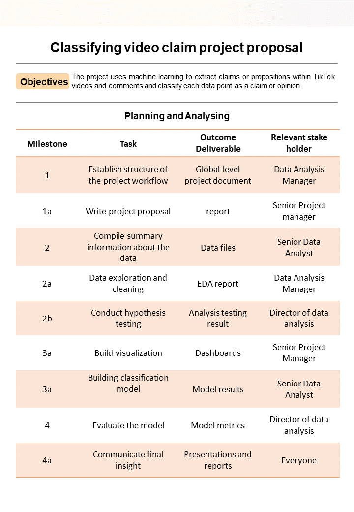

# 2

## Project goal

The TikTok needs machine learning model for classifying claims made in videos submitted to the platform.

## Need to know

TikTok is the leading destination for short-form mobile video. The platform is built to help imaginations thrive. TikTok's mission is to create a place for inclusive, joyful, and authentic content–where people can safely discover, create, and connect.

## Project objective

We take into account new considerations from the leadership team, We will create a project proposal by assigning the required data analytical tasks into realistic milestones that will advise future steps in the claims classification project.

## Actionable step

1. Gather information from stakeholder notes from within TikTok

2. Assign PACE stages to the requested tasks for the classification project

3. Organize tasks into milestones

4. Create a project proposal for the TikTok data team

## PACE Strategy

| Task | stage |
|------|-------|
|Establishing the structure of the project workflow | Plan|
|Writing a project proposal | Plan|
|Data Exploration and cleaning | Analyze |
|conduting hypothesis testing | Analyze|
|compile summary infomation about the data | Analyze|
|Visualisation building | Construct|
|Model building| Construct|
|Evaluating model | Execute|
|Communicate final Insight with stakeholders| Execute|

PACE -> `P`lan, `A`nalyze, `C`onstruct and `E`xecute

