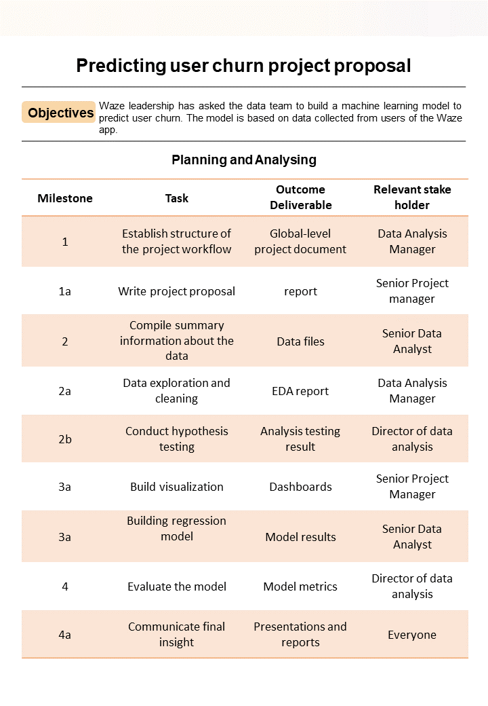

# 3

## Project goal

Waze leadership needs machine learning model to predict user churn. Churn quantifies the number of users who have uninstalled the Waze app or stopped using the app. The project focuses on monthly user churn. An accurate model will help prevent churn, improve user retention, and grow Waze’s business.

## Need to know

Waze’s free navigation app makes it easier for drivers around the world to get to where they want to go. Waze’s community of map editors, beta testers, translators, partners, and users helps make each drive better and safer.

## Project objectives

The first step is to create a project proposal. The proposal will clearly define the overall goal of the project, and identify key tasks, milestones, and stakeholders.

## Actional steps

Assign PACE stages to the requested tasks for the user churn project

Organize tasks into milestones

Create a project proposal for the Waze data team

## PACE Strategy

| Task | stage |
|------|-------|
|Establishing the structure of the project workflow | Plan|
|Writing a project proposal | Plan|
|Data Exploration and cleaning | Analyze |
|conduting hypothesis testing | Analyze|
|compile summary infomation about the data | Analyze|
|Visualisation building | Construct|
|Model building| Construct|
|Evaluating model | Execute|
|Communicate final Insight with stakeholders| Execute|

PACE -> `P`lan, `A`nalyze, `C`onstruct and `E`xecute

